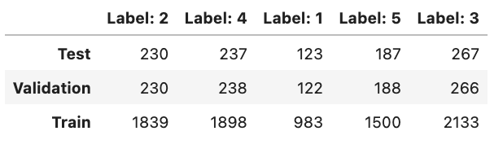
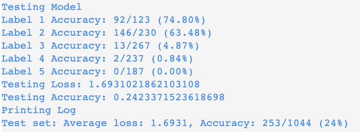
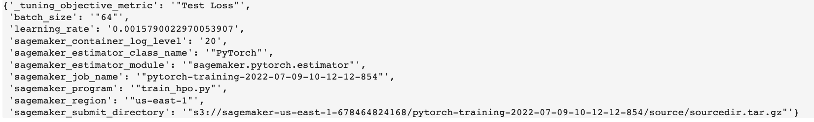
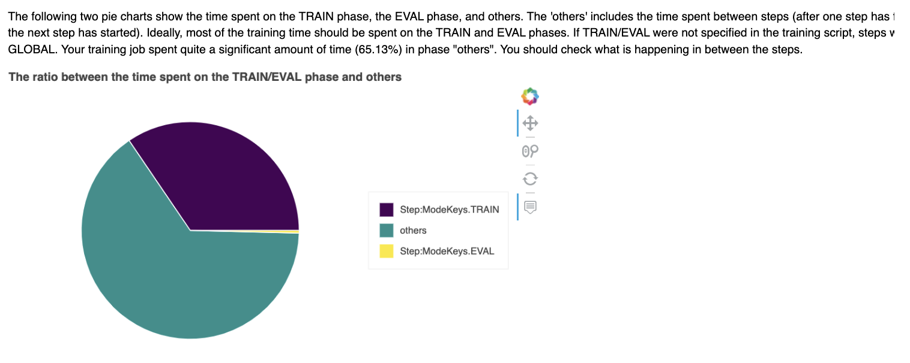
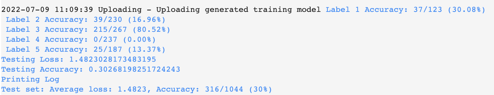
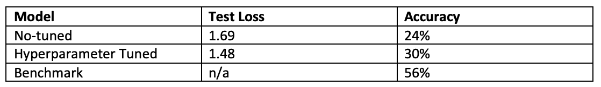
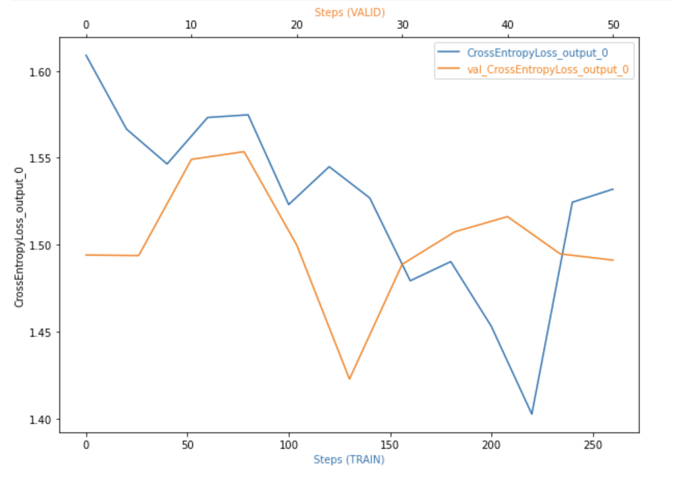
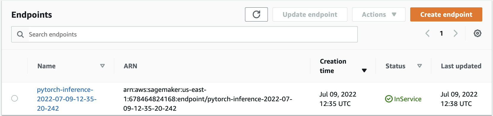
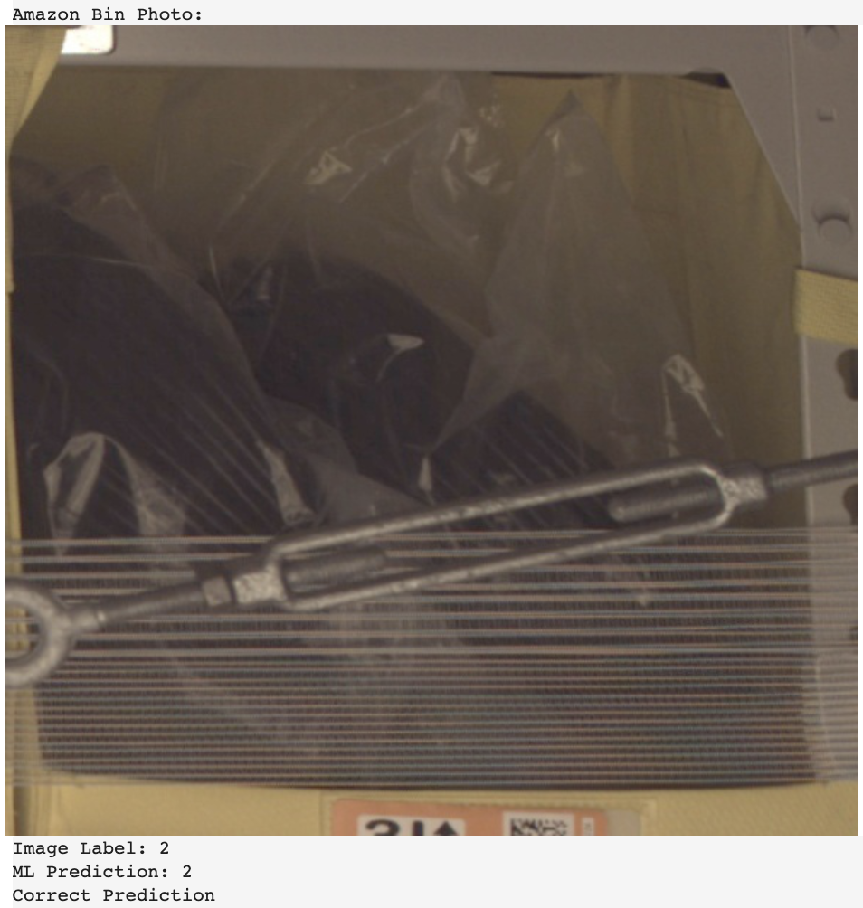
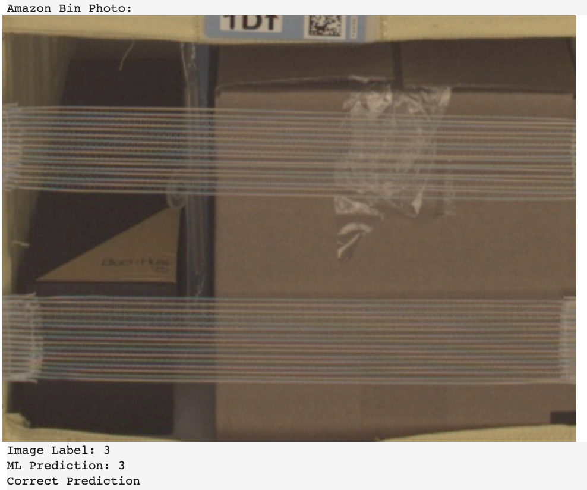

# Machine Learning Engineer Capstone Project: Inventory Monitoring at Distribution Centers
## Counting objects from the images of bins taken by an operating Amazon FC

Distribution centers often use robots to move objects as a part of their operations. Objects are carried in bins which can contain multiple objects. In this project, we will build a deep learning model to count the number of objects in each bin. It is a real-world example as distribution centers would benefit from inventory tracking with correct number of items in delivery consigments.

## Project Set Up and Installation
Our dataset is from "Open Data on AWS" called "Amazon Bin Image Dataset". It contains over 500,000 images and metadata from bins of a pod in an operating Amazon Fulfillment Center. The bin images in this dataset are captured as robot units carry pods during Amazon Fulfillment Center operations.

## Dataset

### Overview
In the dataset, we have metadata on top of the images. To be able to build a model, we had to divide images into labelled folders. However, you could find a json file that already labeled 2% of the dataset (10441 images). We have 5 folders, named as 1,2,3,4,5 which are our classes showing how many objects exist in each bin. If you require more data, you could download from [here](https://registry.opendata.aws/amazon-bin-imagery/).
 
The main purpose of this project is to demonstrate how we could build end-to-end Machine Learning pipeline. Therefore, having smaller dataset will be convenient considering the costs that would raise during AWS services utilization.

### Access
For this project, we are using Amazon Sagemaker notebook instances. It will allow us to build, traing and deploy our machine learning models with fully managed infrastructure. So we do not need to maintain updates or patches. I chose ml.t2.medium instance for notebook, as we will not do train the models on this notebook but Sagemaker will train the models with training jobs which we will be able to determine the number of instances and instance types.

After using notebook instances, we can upload our data to Amazon S3 bucket in several methods. I would suggest to create a specific bucket for the project and follow the jupyter notebook to understand how to upload to Amazon S3.

## Model Training

As we are working with only 2% of the dataset, I wanted to leverage the data as much as I could during training process. The split is stated below:
- Training: 80%
- Testing: 10%
- Validation: 10%

I used ResNet50 network for our task of image classification training. It is a convolutional neural network (CNN) that is 50 layers deep. Each of the 2 layer blocks in previous version of the model Resnet34 was replaced with 3layer bottleneck blocks. It has higher accuracy than Resnet34. On top of that, I used pretrained model, in this way I also had chance to add aditional layers to customize the model further.

In the model training, first I provided learning rate of 0.01 and batch size of 32 to see the model accuracy. It achieved 1.69 test loss with 24% accuracy.

Throughout this course, I learned how convenient it is to run a hyperparameter tuning job via Sagemaker. I chose two parameters to tune in the next step:

* Learning Rate between (0.001 and 0.1) as continuous parameter
> It determines the step size at each iteration while moving toward a minumum of a loss function. Not to miss the minimum, I don't go beyond 0.1.
* Batch Size between (32, 64, 128) as categorical parameter
> It determines the number of training examples utilized in one iteration. We have sample of 8353 images to train the model. So with this ranges, our model will require less memory.

### Best Hyperparameters

It is great to be able to trust Sagemaker with objective metric to find the best hyperparameters. I did not want to increase the ranges further to avoid further increase in the training duration due to cost concerns. Our best hyperparameters are defined by Sagemaker by following:

### Debugging/Profiling Output

After defining the correct hyperparameters, I decided to use Sagemaker Debugger/Profiling. As normally we have to read through logs to identify issues about the model, this helps us to understand problems if the training is not working well and generate a simple report called the Profiler Report that gives us an overview of our training job. As we can see below, there is a callout for time sending not focusing on training and evaluation. Dowloading data from our dataset is big part of the this time spent which can be seen from the logs during the trainings. Another example is the suggestions for different metrics. Profiler Report mentions that the batch size is too small and GPUs are underutilized. It gives us opportunity to make the model more cost efficient. 

### Top Model 

Thanks to the fine tuning, our model achieved 1.48 loss with 30% accuracy.

### Evaluation:

Considering we have used only 2% of the dataset, our top model achieved our goal and achieved 30% accuracy. Our benchmark was coming from Amazon Bin Image Dataset Challenge by silverbottlep as part of publications where he achieved 55.67% accuracy. It shows the potential that when we use more dataset, we could increase this accuracy and achieve a model that can be put into the production. While working with Fulfillment Centers, data collection is really important. Same angle images with high resolution would allow deep learning models to better learn and predict number of objects in each bin. 

Benchmark: [abid_challenge by silverbottlep](https://github.com/silverbottlep/abid_challenge)

### CrossEntropyLoss Output:

## Model Deployment

I created Sagemaker endpoint to be able to predict images after opening the files, followed by predictor.predict(). Sagemaker endpoints cost as long as they are active, so if you are on production, delete the endpoints when you are done. You can see below the created enpoint and few example of inferences. 

## Machine Learning Pipeline

1. Data Ingestion
> Downloading this data by using JSON code with lables and uploading to S3 bucket
2. Data Preparation
> Train-Test-Valid split to get ready for machine learning training  
3. Model Training with Refinements
> Utilizing Resnet50 CNN with additional fully connected layers via PyTorch
4. Model Evaluation 
> Identfiying best model with accuracy metric
5. Model Deployment
> By using Sagemaker endpoints, make the model ready for production

## Source  Files

* [sagemaker.ipynb](sagemaker.ipynb): It is our main file which is a jupyter notebook. We download the dataset, do exploratory data analysis, kick off training jobs for hyperparameter tuning, debugging and profiling, and deploy the model.
* [train_hpo.py](train_hpo.py): It is training script using PyTorch which is used for hyperparameter tuning. 
* [no-tuned.py](no-tuned.py): It is training script using PyTorch, and used hardcoded hyperparameterse. 
* [finetuner.py](finetuner.py): It is training script using PyTorch which is used for debugging/profiling output. The important thing to pay attention is hooks which are in the train and test functions 
* [inference.py](inference.py):It is a script to deploy the model with necessary data processing. After running it, we create an Sagemaker endpoint. Be careful it costs as long as it is active.
* [file_list.json](file_list.json): This has been provided by udacity team to make downloading sample dataset easy for us with labels.

### Folders

* figs: Images that are used at Readme.md file are under this folder
* amazon_images: It currently does not exist but after you run the inital codes in jupyter notebook, our dataset will be in this folder.
* ProfilerReport: Profiler output can be found under this folder.